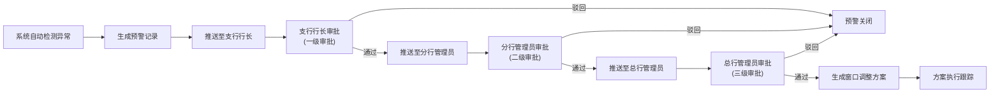
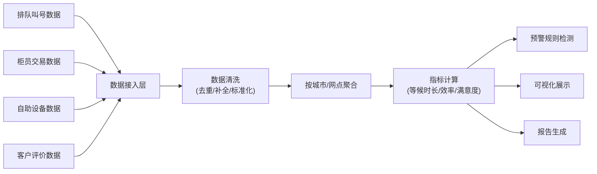

## 1. 产品概述

全国性银行网点运营与客户服务分析平台，实时接入并整合多源业务数据，通过智能分析与预警机制，助力银行管理层优化网点运营效率、提升客户服务质量。平台面向总行、分行、支行三级管理人员，提供数据可视化、智能预警、审批流程和诊断报告等核心功能。

- 解决问题：网点运营数据分散、效率监控滞后、资源调配缺乏数据支撑、客户服务质量难以量化评估
- 目标用户：总行管理人员、分行管理人员、支行行长
- 核心价值：数据驱动决策、运营风险提前预警、服务质量持续优化

## 2. 核心功能

### 2.1 用户角色

| 角色 | 注册方式 | 核心权限 |
|------|----------|----------|
| 总行管理员 | 系统分配 | 全国数据查看、预警审批（终审）、报告管理、权限配置 |
| 分行管理员 | 系统分配 | 所辖城市数据查看、预警审批（二审）、分行报告查看 |
| 支行行长 | 系统分配 | 本网点数据查看、预警审批（初审）、排班上传 |

### 2.2 功能模块

1. **登录与权限控制**：三级角色认证、基于角色的功能访问控制
2. **全国运营看板**：热力图展示、效率排名、核心指标概览
3. **城市下钻分析**：客流趋势图、业务类型占比、网点对比
4. **网点详情页**：实时等候时长、柜员效率排名、客户满意度趋势
5. **预警中心**：自动预警触发、预警列表、三级审批流程
6. **排班管理**：排班表上传、人力与客流自动校验、缺口提醒
7. **诊断报告**：每周自动生成、同比环比分析、优化方案推荐
8. **实时监控**：数据流监控、数据清洗状态、指标实时计算展示

### 2.3 页面详情

| 页面名称 | 模块名称 | 功能描述 |
|----------|----------|----------|
| 登录页 | 身份认证 | 账号密码登录、角色自动识别、会话管理 |
| 全国运营看板 | 热力图模块 | 全国地图按城市/网点着色显示运营效率，支持hover查看详情 |
| 全国运营看板 | 排名模块 | 按等候时长、柜员效率、满意度进行网点/城市排名 |
| 全国运营看板 | 指标概览 | 展示全国平均等候时长、总体满意度、活跃柜员数、今日业务量 |
| 城市下钻页 | 客流趋势 | 折线图展示7天/30天/90天客流变化趋势 |
| 城市下钻页 | 业务占比 | 饼图展示个人业务、对公业务、理财业务等占比 |
| 城市下钻页 | 网点列表 | 展示该城市下所有网点的关键指标和状态 |
| 网点详情页 | 等候时长分析 | 实时等候、日均等候、高峰时段分析 |
| 网点详情页 | 柜员效率 | 柜员业务量排名、平均处理时长、客户评价 |
| 网点详情页 | 满意度趋势 | 日/周/月满意度趋势图、评价关键词云 |
| 预警中心 | 预警列表 | 展示所有预警，支持按状态、级别、时间筛选 |
| 预警中心 | 审批流程 | 支行→分行→总行三级审批，支持填写意见 |
| 排班管理 | 排班上传 | Excel模板上传、格式校验、数据导入 |
| 排班管理 | 人力校验 | 自动对比排班人力与预测客流，缺口超20%时提醒 |
| 诊断报告 | 报告列表 | 展示历史报告，支持按时间范围筛选 |
| 诊断报告 | 报告详情 | 等候时长同比环比、投诉分布、设备故障率、优化建议 |
| 实时监控 | 数据流监控 | 排队叫号、柜员交易、自助设备、客户评价四流数据接入状态 |
| 实时监控 | 数据清洗 | 展示数据清洗规则、处理记录、异常数据统计 |
| 实时监控 | 指标计算 | 各指标实时计算过程和结果展示 |

## 3. 核心流程

### 3.1 预警审批流程

当系统检测到某网点连续3天等候时长超标准30%或满意度低于80%时，自动触发预警。

### 3.2 数据处理流程

## 4. 用户界面设计

### 4.1 设计风格

- **主色调**：深蓝色（#0B2A5A）代表专业和可信赖
- **辅助色**：金色（#C9A962）点缀，体现金融品质感
- **警示色**：红色（#E53935）用于高预警，橙色（#FB8C00）用于中预警，黄色（#FDD835）用于低预警
- **成功色**：绿色（#43A047）表示正常状态
- **中性色**：深灰（#2C3E50）、中灰（#7F8C8D）、浅灰（#ECF0F1）

- **按钮风格**：圆角矩形（border-radius: 6px），主按钮深蓝色填充，悬停时微亮
- **卡片风格**：浅灰色背景，微妙阴影，边框1px，圆角8px
- **字体**：主标题使用 "Noto Serif SC" 展示金融稳重感，正文使用 "Noto Sans SC" 保证可读性
- **布局风格**：侧边导航+顶部状态栏+主内容区，卡片式布局
- **图标风格**：线性图标，统一粗细，颜色与主色调协调

### 4.2 页面设计概览

| 页面名称 | 模块名称 | UI元素 |
|----------|----------|--------|
| 登录页 | 登录表单 | 深蓝色背景，金色渐变装饰，卡片式登录框，品牌Logo，输入框动效 |
| 全国运营看板 | 热力图 | 中国地图渐变色填充，hover浮窗展示详情，点击下钻动画 |
| 全国运营看板 | 指标卡片 | 四个核心指标卡片，数字滚动动画，趋势箭头指示 |
| 全国运营看板 | 排名列表 | 表格+进度条混合展示，前三名特殊高亮 |
| 城市下钻页 | 趋势图表 | ECharts折线图，多维度切换，数据点hover详情 |
| 城市下钻页 | 业务占比 | 环形饼图，图例交互，百分比显示 |
| 预警中心 | 预警列表 | 彩色状态标签，三级审批进度条，操作按钮组 |
| 排班管理 | 上传区域 | 拖拽上传区域，Excel图标，进度条展示 |
| 诊断报告 | 报告详情 | 分章节卡片布局，图表与文字混排，可打印样式 |
| 实时监控 | 数据流 | 动画连接线，实时数据跳动，状态指示灯 |

### 4.3 响应式设计

- 采用桌面优先设计，最小支持宽度1366px
- 主内容区使用弹性布局，适配1366px-2560px宽度
- 侧边栏支持折叠，为数据看板提供更大展示空间
- 图表组件自适应容器宽度，支持窗口 resize 实时重绘
- 表格组件支持横向滚动，保证大数据量展示

### 4.4 视觉动效

- **页面加载**：骨架屏占位，内容渐入动画
- **数据更新**：数字滚动过渡，图表曲线平滑绘制
- **预警提示**：脉冲动画提醒，新消息红点闪烁
- **交互反馈**：按钮点击缩放，卡片悬停微抬升阴影
- **审批流转**：节点高亮动画，进度条平滑过渡
