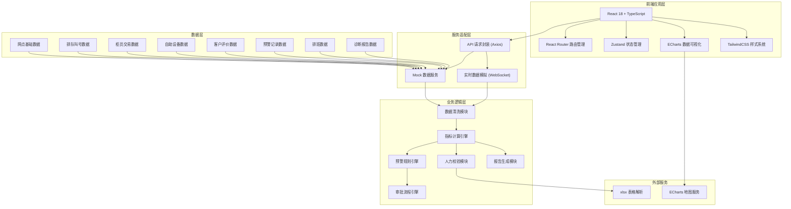
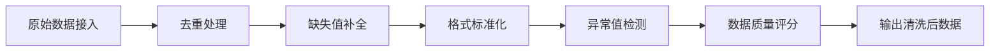
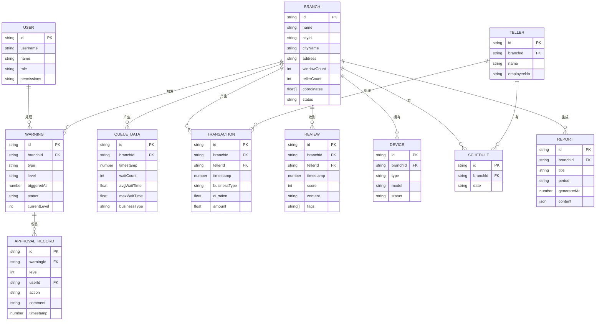

## 1. 架构设计



## 2. 技术描述

### 2.1 核心技术栈

| 类别 | 技术选型 | 版本 | 用途说明 |
|------|----------|------|----------|
| 前端框架 | React | 18.x | 组件化UI开发 |
| 语言 | TypeScript | 5.x | 类型安全保证 |
| 构建工具 | Vite | 5.x | 快速开发构建 |
| 路由 | React Router | 6.x | 单页应用路由 |
| 状态管理 | Zustand | 4.x | 轻量级全局状态管理 |
| 样式 | TailwindCSS | 3.x | 原子化CSS框架 |
| 图表 | ECharts | 5.x | 数据可视化（含地图） |
| HTTP请求 | Axios | 1.x | API请求封装 |
| 日期处理 | dayjs | 1.x | 日期格式化与计算 |
| 表格解析 | xlsx | 0.18.x | Excel排班表解析 |
| UI组件 | 自定义组件 | - | 业务组件库 |

### 2.2 项目结构设计

```
src/
├── assets/                 # 静态资源（字体、图片、图标）
│   ├── fonts/
│   ├── images/
│   └── icons/
├── components/             # 通用业务组件
│   ├── layout/            # 布局组件
│   │   ├── Sidebar.tsx
│   │   ├── Header.tsx
│   │   └── MainLayout.tsx
│   ├── charts/            # 图表组件
│   │   ├── LineChart.tsx
│   │   ├── BarChart.tsx
│   │   ├── PieChart.tsx
│   │   └── MapChart.tsx
│   ├── common/            # 通用UI组件
│   │   ├── Button.tsx
│   │   ├── Card.tsx
│   │   ├── Table.tsx
│   │   ├── Modal.tsx
│   │   ├── Tag.tsx
│   │   └── StatusBadge.tsx
│   └── business/          # 业务专属组件
│       ├── KpiCard.tsx
│       ├── ApprovalFlow.tsx
│       ├── WarningItem.tsx
│       └── DataStream.tsx
├── pages/                  # 页面组件
│   ├── Login/
│   ├── Dashboard/
│   ├── CityDetail/
│   ├── BranchDetail/
│   ├── WarningCenter/
│   ├── Schedule/
│   ├── Reports/
│   └── Monitor/
├── store/                  # 状态管理
│   ├── useAuthStore.ts
│   ├── useDataStore.ts
│   └── useWarningStore.ts
├── api/                    # API接口层
│   ├── index.ts
│   ├── mock/              # Mock数据
│   │   ├── branches.ts
│   │   ├── queue.ts
│   │   ├── transactions.ts
│   │   ├── devices.ts
│   │   ├── reviews.ts
│   │   ├── warnings.ts
│   │   ├── schedule.ts
│   │   └── reports.ts
│   └── types.ts           # API类型定义
├── utils/                  # 工具函数
│   ├── dataCleaner.ts      # 数据清洗
│   ├── metrics.ts          # 指标计算
│   ├── warningRules.ts     # 预警规则
│   ├── approval.ts         # 审批流程
│   ├── scheduleCheck.ts    # 排班校验
│   ├── reportGenerator.ts  # 报告生成
│   └── format.ts           # 格式化工具
├── hooks/                  # 自定义Hooks
│   ├── useAuth.ts
│   ├── useRealTimeData.ts
│   ├── useMetrics.ts
│   └── usePermission.ts
├── styles/                 # 全局样式
│   ├── index.css
│   └── variables.css
├── router/                 # 路由配置
│   └── index.tsx
├── types/                  # 全局类型定义
│   ├── index.ts
│   ├── branch.ts
│   ├── queue.ts
│   ├── transaction.ts
│   ├── review.ts
│   ├── warning.ts
│   ├── schedule.ts
│   └── report.ts
├── App.tsx
└── main.tsx
```

## 3. 路由定义

| 路由路径 | 页面名称 | 权限要求 | 说明 |
|----------|----------|----------|------|
| /login | 登录页 | 公开 | 用户身份认证入口 |
| /dashboard | 全国运营看板 | 所有角色 | 总行查看全国，分行查看所辖，支行查看本网点 |
| /city/:cityId | 城市下钻页 | 总行/分行 | 城市级数据分析 |
| /branch/:branchId | 网点详情页 | 所有角色 | 网点详细运营数据 |
| /warnings | 预警中心 | 所有角色 | 预警列表和审批操作 |
| /schedule | 排班管理 | 支行/分行 | 排班上传和人力校验 |
| /reports | 诊断报告 | 所有角色 | 查看和下载诊断报告 |
| /monitor | 实时监控 | 总行/分行 | 数据流和清洗监控 |

## 4. API 定义（Mock 层）

### 4.1 类型定义

```typescript
// 用户角色类型
export type UserRole = 'headquarters' | 'branch' | 'subbranch';

// 用户信息
export interface User {
  id: string;
  username: string;
  name: string;
  role: UserRole;
  cityId?: string;
  branchId?: string;
  permissions: string[];
}

// 网点信息
export interface Branch {
  id: string;
  name: string;
  cityId: string;
  cityName: string;
  address: string;
  windowCount: number;
  tellerCount: number;
  coordinates: [number, number];
  status: 'normal' | 'warning' | 'critical';
}

// 排队数据
export interface QueueData {
  id: string;
  branchId: string;
  timestamp: number;
  waitCount: number;
  avgWaitTime: number;
  maxWaitTime: number;
  businessType: string;
}

// 交易数据
export interface Transaction {
  id: string;
  branchId: string;
  tellerId: string;
  tellerName: string;
  timestamp: number;
  businessType: string;
  duration: number;
  amount?: number;
}

// 评价数据
export interface Review {
  id: string;
  branchId: string;
  tellerId?: string;
  timestamp: number;
  score: number;
  content: string;
  tags: string[];
}

// 预警记录
export interface Warning {
  id: string;
  branchId: string;
  branchName: string;
  type: 'wait_time' | 'satisfaction';
  level: 'high' | 'medium' | 'low';
  triggeredAt: number;
  description: string;
  currentLevel: number;
  status: 'pending' | 'approved' | 'rejected' | 'completed';
  approvals: ApprovalRecord[];
}

// 审批记录
export interface ApprovalRecord {
  id: string;
  warningId: string;
  level: number;
  userId: string;
  userName: string;
  role: UserRole;
  action: 'approve' | 'reject';
  comment: string;
  timestamp: number;
}

// 排班数据
export interface Schedule {
  id: string;
  branchId: string;
  date: string;
  tellers: TellerSchedule[];
}

export interface TellerSchedule {
  tellerId: string;
  tellerName: string;
  shift: 'morning' | 'afternoon' | 'full';
  windowNumber: number;
}

// 诊断报告
export interface Report {
  id: string;
  title: string;
  period: string;
  generatedAt: number;
  scope: 'national' | 'city' | 'branch';
  scopeId?: string;
  content: ReportContent;
}

export interface ReportContent {
  waitTimeAnalysis: {
    avgWaitTime: number;
    yoyChange: number;
    momChange: number;
    peakHours: string[];
  };
  complaintDistribution: {
    category: string;
    count: number;
    percentage: number;
  }[];
  deviceFailureRate: {
    deviceType: string;
    failureCount: number;
    totalCount: number;
    rate: number;
  }[];
  recommendations: string[];
}
```

### 4.2 Mock 接口列表

```typescript
// 认证相关
POST /api/auth/login          // 登录
POST /api/auth/logout         // 登出
GET  /api/auth/user           // 获取当前用户信息

// 网点相关
GET /api/branches             // 获取网点列表（按权限过滤）
GET /api/branches/:id         // 获取网点详情
GET /api/branches/metrics     // 获取网点聚合指标

// 数据相关
GET /api/queue/realtime       // 实时排队数据
GET /api/queue/history        // 历史排队数据
GET /api/transactions         // 交易数据
GET /api/devices/status       // 自助设备状态
GET /api/reviews              // 客户评价数据

// 预警相关
GET /api/warnings             // 预警列表
GET /api/warnings/:id         // 预警详情
POST /api/warnings/:id/approve // 审批预警

// 排班相关
POST /api/schedule/upload     // 上传排班表
GET  /api/schedule/:branchId  // 获取排班
GET  /api/schedule/check      // 人力校验结果

// 报告相关
GET /api/reports              // 报告列表
GET /api/reports/:id          // 报告详情
POST /api/reports/generate    // 手动生成报告

// 监控相关
GET /api/monitor/stream       // 数据流状态
GET /api/monitor/cleaning     // 数据清洗状态
GET /api/monitor/metrics      // 指标计算状态
```

## 5. 核心模块架构

### 5.1 数据清洗模块



### 5.2 指标计算引擎

```typescript
// 核心指标计算规则
const metricsRules = {
  avgWaitTime: (data) => average(data.map(d => d.avgWaitTime)),
  tellerEfficiency: (transactions) => {
    const grouped = groupBy(transactions, 'tellerId');
    return mapValues(grouped, (tellerTrans) => ({
      avgDuration: average(tellerTrans.map(t => t.duration)),
      transactionCount: tellerTrans.length,
      efficiencyScore: 100 - (avgDuration - baseline) * 2
    }));
  },
  satisfaction: (reviews) => {
    return average(reviews.map(r => r.score)) * 20;
  }
};
```

### 5.3 预警规则引擎

```typescript
// 预警触发规则
const warningRules = [
  {
    id: 'wait_time_exceed',
    name: '等候时长超标',
    check: (branchData) => {
      const threeDayData = getLastNDays(branchData.queueHistory, 3);
      const standard = 15; // 标准15分钟
      return threeDayData.every(day => 
        day.avgWaitTime > standard * 1.3
      );
    },
    level: 'high'
  },
  {
    id: 'satisfaction_low',
    name: '满意度过低',
    check: (branchData) => {
      const recentReviews = getLastNDays(branchData.reviews, 3);
      const avgScore = average(recentReviews.map(r => r.score)) * 20;
      return avgScore < 80;
    },
    level: 'medium'
  }
];
```

### 5.4 审批流程引擎

```typescript
const approvalFlow = {
  levels: [
    { level: 1, role: 'subbranch', name: '支行行长审批' },
    { level: 2, role: 'branch', name: '分行管理员审批' },
    { level: 3, role: 'headquarters', name: '总行管理员审批' }
  ],
  
  canApprove: (userRole, currentLevel) => {
    const requiredRole = approvalFlow.levels[currentLevel - 1].role;
    return userRole === requiredRole || userRole === 'headquarters';
  },
  
  nextLevel: (currentLevel) => {
    return currentLevel < 3 ? currentLevel + 1 : null;
  }
};
```

### 5.5 人力校验模块

```typescript
const scheduleCheck = {
  calculateGap: (schedule, predictedFlow) => {
    const availableWindows = countActiveWindows(schedule);
    const requiredWindows = Math.ceil(predictedFlow / 40); // 每窗口日处理40笔
    const gap = requiredWindows - availableWindows;
    const gapPercentage = (gap / requiredWindows) * 100;
    
    return {
      availableWindows,
      requiredWindows,
      gap,
      gapPercentage,
      needWarning: gapPercentage > 20
    };
  }
};
```

## 6. 数据模型

### 6.1 ER 图



### 6.2 索引设计

| 表名 | 索引字段 | 索引类型 | 说明 |
|------|----------|----------|------|
| QUEUE_DATA | branchId, timestamp | 联合索引 | 按网点和时间范围查询 |
| TRANSACTION | branchId, tellerId, timestamp | 联合索引 | 交易统计分析 |
| REVIEW | branchId, timestamp | 联合索引 | 满意度趋势分析 |
| WARNING | branchId, status, triggeredAt | 联合索引 | 预警列表筛选 |
| APPROVAL_RECORD | warningId, level | 联合索引 | 审批进度查询 |
| SCHEDULE | branchId, date | 唯一索引 | 排班查询 |

### 6.3 Mock 数据规范

- 覆盖全国30+主要城市，200+网点
- 数据时间范围：最近90天
- 包含正常数据和异常数据（用于预警测试）
- 数据量级：排队数据10万+条，交易数据50万+条，评价数据10万+条
- 预置10+条预警记录（包含不同审批状态）
- 预置10+份历史诊断报告
